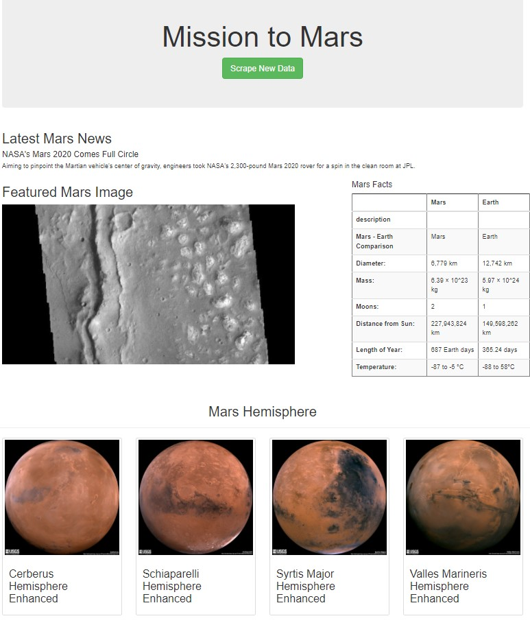

# Mission-to-Mars
Use BeautifulSoup and Splinter to scrape websites pertaining to the Mission to Mars, store the scraped data on a Mongo database, and build a web application to display the findings.

Libraries and tools that need for web scraping (a technique to gather data from multiple websites, store it in a database, then present the collected data in a central location, a webpage):
1. Splinter to automate a web browser
2. BeautifulSoup to parse and extract the data
3. MongoDB to hold the data that has been gathered
4. Flask to built a webpage to present the results

Deliverable included:
1. `Mission_to_Mars_Challenge.ipynb` file with all the code used for scraping.
2. `scraping.py` file for scraping websites in a structured format.
3. `app.py` file for the code of web application using Flask.
4. `index.html` file in the template folder for output formating.

The following Bootstrap 3 components are added:
1. Styling the button: set to large button and in 'Green' in `index.html`
2. Add table-striped to the mars-fact table in the function mars_facts() defined in `scraping.py`.
3. Adding the hemisphere images as thumbnails in `index.html`

Final output:

